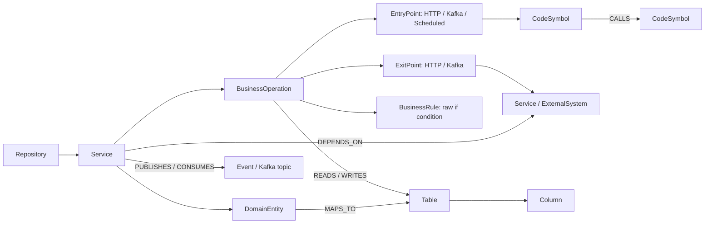

# Repository Graph для GigaCode

Изолированный модуль `gigacode_graph` принимает Git URL или локальные checkout-ы и строит
evidence-backed граф Java/Spring-сервисов. Git URL автоматически клонируются в управляемый cache;
при следующем запуске тот же command обновляет их до нового commit. Один snapshot используется
тремя интерфейсами:

- read-only MCP для GigaCode CLI;
- обычный CLI для индексирования и отладки запросов;
- HTTP-сервер с JSON API и встроенным SVG UI.

Модуль не исполняет Maven/Gradle, исходный код сервисов или миграции. На первой итерации граф
хранится в понятном versioned JSON. Интерфейс `GraphStore` отделяет хранение, поэтому после проверки
метамодели его можно заменить Neo4j без изменения MCP tools и UI API.

## Что попадает в граф



Сканер извлекает:

- имя сервиса из `gigacode-graph.json`, `spring.application.name`, Maven `artifactId` или имени
  каталога;
- Spring MVC endpoints, Feign-клиенты, `@KafkaListener`, literal Kafka producers и `@Scheduled`;
- ограниченный по бюджету Java/Kotlin call graph от точек входа и всех классов с
  `@Service`/`@Component`/`@Configuration` (включая локальные составные аннотации);
- слабые кандидаты зависимостей для вызовов внедрённых `*Client`, `*Gateway`, `*Api`,
  `*Service`, `*Adapter` и похожих портов, даже если transport пока не распознан;
- сырые условия `if` как кандидаты бизнес-правил;
- JPA entities, tables, columns и Spring Data repositories;
- таблицы из Flyway/Liquibase SQL, YAML и XML migrations;
- межрепозиторные HTTP и Kafka-зависимости.

У каждого извлечённого факта есть `evidence_id`, ведущий к repository, commit, file, line, snippet и
extractor. Выводы имеют `DECLARED`, `HIGH`, `MEDIUM`, `LOW` или `UNRESOLVED` confidence.

## Два режима перестройки в RAG Control Plane

На странице **«Граф системы»** основной сервер предлагает два независимых режима:

- **«Быстро»** — только deterministic Java/Kotlin/tree-sitter анализ, без запуска build и LLM;
- **«Точный rebuild»** — тот же статический scan, затем read-only GigaCode проверяет bounded-пакеты
  уже найденных межсервисных dependency-кандидатов.

Во втором режиме сервер передаёт GigaCode candidate id, исходный/предполагаемый целевой сервис,
интерфейс и имеющееся evidence. Модель возвращает `confirm`, `reject`, `retarget` или `unresolved`.
Дополнительно первый пакет каждого repository разрешает discovery пропущенных custom-wrapper
вызовов, начиная с service/component-оркестраторов. Сначала проверяются `UNRESOLVED` и `LOW`
кандидаты; один repository по умолчанию отдаёт модели не более 250 кандидатов за rebuild, чтобы
массовый граф не создавал неограниченное число model runs. Новый edge принимается только если
GigaCode указал существующую source-строку, выбрал
конкретный уже найденный target entrypoint и их нормализованные protocol/operation совпали. Поэтому
у discovery-edge всегда есть evidence вызывающей и принимающей стороны; произвольные сервисы,
строки и API сервер отбрасывает.

До GigaCode работает deterministic contract matcher. Он разрешает `${property}` из `.properties` и
простого YAML, извлекает Spring MVC, Feign, Spring HTTP Interface, WebClient/RestTemplate,
KafkaTemplate, `@KafkaListener` и `@SendTo`. HTTP сопоставляется по service alias/hostname и
нормализованному `method + path` (`{id}` и `{paymentId}` считаются одним шаблоном), Kafka — по
точному topic. Если path соответствует нескольким сервисам, связь остаётся `UNRESOLVED`.

Каждый опубликованный результат имеет общие для `graph.json` и `service_map.json` поля
`schema_version`, `snapshot_id`, `analysis_mode` и `verification`. Цвета UI соответствуют confidence:

- зелёный — `DECLARED`, связь задана конфигурацией или декларацией;
- синий — `HIGH`, связь подтверждена сильным source evidence;
- жёлтый — `MEDIUM`, вероятная связь;
- оранжевый — `LOW`, слабая гипотеза;
- красный — `UNRESOLVED`, цель определить не удалось.

Отклонённые связи остаются в versioned graph для аудита, но по умолчанию не показываются в UI,
service map и feature-routing. Raw GigaCode result записывается в
`.cache/kb/analysis/gigacode-verification/`. Перестройка сохраняет только отдельные `graph.json`,
`service_map.json` и analysis archive. Граф не превращается в документы, не загружается в RAG и не
запускает перестройку embeddings. Для клиентов он доступен через MCP tool `kb_system_graph`.

Явный rebuild временно восстанавливает каждый отсутствующий managed checkout и удерживает все
исходники до конца цепочки static scan → global relink → GigaCode verification → publication.
После завершения, отмены или ошибки checkout-ы удаляются в `finally`, если включён cleanup.
Локальные пользовательские checkout-ы этим lifecycle не удаляются.

Административный API принимает:

```bash
# быстрый режим
curl -k -X POST https://127.0.0.1:8000/admin/api/graph/rebuild \
  -H 'Content-Type: application/json' \
  -d '{"generation_mode":"static","verify_all":false}'

# полный проход GigaCode по всем dependency-кандидатам
curl -k -X POST https://127.0.0.1:8000/admin/api/graph/rebuild \
  -H 'Content-Type: application/json' \
  -d '{"generation_mode":"gigacode","verify_all":true}'
```

Для просмотра можно передавать CSV-фильтры `node_types`, `edge_types`, `confidences`, а также
`connected_only=true` и `include_rejected=true` в `GET /admin/api/graph`.

В service-view параллельные HTTP/Kafka операции одной пары сервисов агрегируются в одну линию по
protocol. Hover показывает количество и список операций; цвет берётся по самой слабой из них, чтобы
агрегация не скрывала неопределённость. Full graph по-прежнему показывает отдельные API/events.
Frontend сохраняет координаты узлов между dashboard polling-запросами, поэтому фоновые job updates
не перезапускают force simulation и не сбрасывают пользовательскую камеру.

## Быстрый запуск

Требуется уже созданная `.venv` проекта с Python 3.12.

Для одного репозитория достаточно ссылки:

```bash
source .venv/bin/activate
python -m gigacode_graph.cli up \
  git@gitlab.company.ru:commerce/order-service.git
```

`up` выполняет весь pipeline и остаётся запущенным: clone/update → analysis → artifacts → UI +
MCP. После команды UI доступен на `http://127.0.0.1:8077/graph`, MCP — на
`http://127.0.0.1:8077/mcp`. Если сервер уже запущен отдельно, используйте неблокирующий `index` —
он только обновит repositories и artifacts, а сервер подхватит новый snapshot автоматически.

Несколько репозиториев также можно передать одной командой:

```bash
python -m gigacode_graph.cli index \
  https://gitlab.company.ru/commerce/order-service.git \
  https://gitlab.company.ru/warehouse/inventory-service.git \
  https://gitlab.company.ru/payments/payment-service.git
```

Повтор той же команды выполняет `git fetch`, переключает управляемый checkout на новый commit,
атомарно заменяет `graph.json` и записывает связанный ingestion inventory. Конкретная branch, tag
или commit задаётся через `--ref`:

```bash
python -m gigacode_graph.cli index \
  git@gitlab.company.ru:commerce/order-service.git \
  --ref release/2026.08
```

После этого доступны обычные запросы:

```bash

python -m gigacode_graph.cli stats
python -m gigacode_graph.cli services
python -m gigacode_graph.cli show order-service
python -m gigacode_graph.cli dependencies order-service --direction both --depth 2
python -m gigacode_graph.cli business order-service
python -m gigacode_graph.cli data-model --service order-service
python -m gigacode_graph.cli search "проверка лимита"
```

По умолчанию всё раскладывается автоматически:

```text
.cache/gigacode-graph/
├── repositories/       # управляемые shallow Git checkouts
├── graph.json          # versioned nodes, edges, evidence и issues
└── ingestion.json      # URL/ref → checkout → точный commit → graph snapshot
```

Другой путь графа задаётся `--store` или `GIGACODE_GRAPH_STORE_PATH`. При `--store` clone cache и
`ingestion.json` создаются рядом с указанным `graph.json`. Полный список переменных есть в
[`examples/gigacode-graph.env.example`](examples/gigacode-graph.env.example).

Приватные repositories используют стандартную Git-аутентификацию машины: SSH agent/key или Git
credential helper. Логин, пароль и token нельзя вставлять в HTTP URL — ingestion отклонит такую
ссылку, чтобы секрет не попал в `.git/config`, логи и artifacts. Для полностью автоматического
запуска credentials должны быть настроены заранее без interactive prompt.

Локальные checkout-ы по-прежнему поддерживаются и никогда не обновляются/изменяются индексатором:

```bash
python -m gigacode_graph.cli index /absolute/repos/order-service
```

Для большого списка репозиториев удобнее manifest:

```bash
python -m gigacode_graph.cli index \
  --manifest examples/gigacode-graph-repositories.example.json
```

Manifest принимает `url`, необязательный `ref` и локальный `path`; относительный `path` разрешается
относительно самого manifest-файла. В корне отдельного сервиса можно добавить точное описание
`gigacode-graph.json`:

```json
{
  "service": {
    "id": "order-service",
    "displayName": "Orders",
    "owner": "commerce-platform",
    "aliases": ["orders", "order-api"]
  }
}
```

Aliases нужны для связывания `@FeignClient(name = "orders")`, DNS hostname и имени репозитория с
одним service node.

## MCP для GigaCode CLI

После индексирования добавьте server entry из
[`examples/gigacode-graph-mcp.example.json`](examples/gigacode-graph-mcp.example.json) в настройки
MCP вашей версии GigaCode. Все пути должны быть абсолютными. Надёжный вариант запускает модуль
через Python из `.venv`:

```json
{
  "mcpServers": {
    "repository-graph": {
      "command": "/absolute/project/.venv/bin/python",
      "args": ["-m", "gigacode_graph.mcp_server"],
      "cwd": "/absolute/project",
      "env": {
        "PYTHONPATH": "/absolute/project/src",
        "GIGACODE_GRAPH_STORE_PATH": "/absolute/project/.cache/gigacode-graph/graph.json"
      }
    }
  }
}
```

GigaCode получает семь read-only tools:

- `code_graph_overview`;
- `code_graph_search`;
- `code_graph_service`;
- `code_graph_dependencies`;
- `code_graph_business_operations`;
- `code_graph_data_model`;
- `code_graph_evidence`.

Рекомендуемый порядок для задачи бизнеса: найти термины и операции, получить карточки найденных
сервисов, пройти зависимости, проверить модель данных, затем запросить evidence спорных связей.
Нельзя строить план изменения только по `LOW`/`UNRESOLVED` фактам.

## Сервер и UI

```bash
PYTHONPATH=src .venv/bin/python -m gigacode_graph.http_server
```

Откройте `http://127.0.0.1:8077/graph`. MCP Streamable HTTP доступен по
`http://127.0.0.1:8077/mcp`, JSON API — под `/api/*`, health check — `/health`.
Если CLI заменил `graph.json`, уже работающие MCP и UI загружают новый snapshot автоматически на
следующем запросе.

Локальный loopback по умолчанию работает без токена. Если задан
`GIGACODE_GRAPH_BEARER_TOKEN`, токен должен содержать не менее 32 символов и защищает MCP и JSON
API. При bind на адрес вне loopback сильный токен обязателен:

```bash
export GIGACODE_GRAPH_HTTP_HOST=0.0.0.0
export GIGACODE_GRAPH_BEARER_TOKEN="$(openssl rand -hex 32)"
PYTHONPATH=src .venv/bin/python -m gigacode_graph.http_server
```

Основной RAG/MCP-процесс сам завершает TLS сертификатами из `certs/`; отдельный reverse proxy не
обязателен.

## Жёсткие ограничения первой версии

Это архитектурный индекс, а не компилятор и не истина о runtime:

- Tree-sitter разбирает Java-структуру, но framework/source extractors не видят вызовы через
  reflection, generated code, dynamic proxies и сложный polymorphism;
- Spring profiles, conditional beans, service discovery, gateway rewrite и внешняя конфигурация
  могут менять реальный маршрут;
- динамически собранные URL и topic names будут неполными или `UNRESOLVED`;
- raw `if` — лишь кандидат бизнес-правила. Без доменной документации он не доказывает бизнес-смысл;
- JPA mapping не доказывает владение БД, а одинаковые таблицы в разных сервисах намеренно имеют
  разные IDs;
- snapshot показывает статически возможную связь, а не её частоту и не факт вызова в production.

Поэтому следующий правильный слой — сопоставление static graph с OpenTelemetry traces, Kafka
metadata, database catalog и SSOT/RAG. LLM-обогащение стоит добавлять отдельным контролируемым
этапом: модель предлагает summary и доменные теги, но не создаёт доказательные edges без source или
runtime evidence.

Автоматическое создание Jira-задач и pull requests в этот модуль не входит. До приемлемой полноты
и precision графа такой write-agent опасен: он быстро масштабирует ошибочный impact analysis. MCP
намеренно read-only.

## Проверка

```bash
PYTHONPATH=src .venv/bin/pytest -q tests/test_gigacode_graph.py
.venv/bin/ruff check src/gigacode_graph tests/test_gigacode_graph.py
.venv/bin/mypy src/gigacode_graph
```
