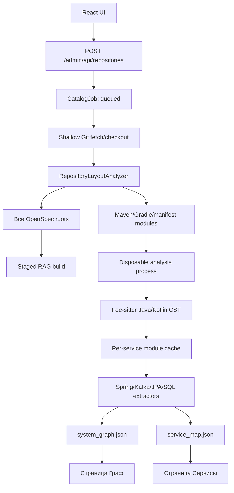

# Анализ Java/Kotlin-репозиториев и карта сервисов

Этот документ описывает фактический алгоритм RAG Control Plane после перехода на module-aware
анализ. Он относится к страницам «Сервисы» и «Граф» в `/admin`, фоновым repository jobs и файлам
`.cache/kb/system_graph.json` и `.cache/kb/service_map.json`.

Standalone CLI графа описан отдельно в
[README.gigacode-graph.md](README.gigacode-graph.md).

## Что теперь поддерживается

- один Git repository может содержать несколько Maven или Gradle modules;
- build module и service больше не считаются одним и тем же: deployable boundary определяется по
  manifest, Spring/application markers и entrypoints, а библиотечные подмодули прикрепляются к
  ближайшему однозначному service;
- объявленный пустой module сохраняется со статусом `empty` и не ломает общий build;
- repository и module могут не содержать `openspec`;
- индексируются все найденные каталоги `openspec`, а не только первый;
- структура Java и Kotlin разбирается готовыми `tree-sitter-java` и `tree-sitter-kotlin`;
- Maven/Gradle и исходный код repository не исполняются;
- одинаковые `service_id` получают стабильные уникальные IDs и диагностический issue;
- неоднозначный HTTP target остаётся `UNRESOLVED`, а не связывается с произвольным сервисом;
- ошибка синтаксиса одного Java/Kotlin-файла не останавливает анализ остальных modules;
- layout делает один recursive inventory-проход по checkout, scanner получает готовые списки
  файлов, а результат каждого service хранится в content-aware module cache;
- кнопка повторного анализа bypass-ит cache только выбранного service; остальные сервисы берутся
  из cache и затем заново линкуются в общий system graph.

## Почему выбран Tree-sitter, а не полностью готовая code graph система

Готовые решения существуют:

- [Joern](https://docs.joern.io/code-property-graph/) строит полноценный Code Property Graph;
- [jQAssistant](https://jqassistant.github.io/jqassistant/current/) сканирует Java-структуру в Neo4j;
- [Spoon](https://spoon.gforge.inria.fr/) предоставляет подробную Java AST/model API;
- [CodeQL](https://docs.github.com/en/code-security/reference/code-scanning/codeql-build-options-for-compiled-languages)
  умеет индексировать Java в no-build режиме.

Они не были хорошей заменой для runtime-ядра этого сервиса:

| Решение | Почему не взято как обязательное ядро |
|---|---|
| Joern | отдельная JVM/CLI/CPG storage и более тяжёлый lifecycle, чем минутный локальный scan |
| jQAssistant | ориентирован на class files, Maven integration и Neo4j; для полного результата обычно нужен собранный bytecode |
| Spoon | качественная Java-модель, но требует JDK/JVM sidecar и отдельный protocol между Python и Java |
| CodeQL | сильная индексирующая система, но отдельный CLI/database lifecycle и licensing/distribution ограничения для такого встраивания |

Для текущих требований выбран
[Tree-sitter](https://tree-sitter.github.io/tree-sitter/) с официальной
[Java grammar](https://github.com/tree-sitter/tree-sitter-java) и
[Kotlin grammar](https://github.com/fwcd/tree-sitter-kotlin): он быстро строит concrete syntax
tree, устойчив к незавершённому коду, имеет готовые Python wheels и не требует JDK, Maven, Gradle или
скачивания dependencies анализируемого проекта.

Tree-sitter решает **синтаксическую индексацию**, но сам не знает Spring, Feign, Kafka и смысл
межсервисных вызовов. Поэтому поверх CST остаётся небольшой слой domain extractors. Регулярные
выражения теперь используются для распознавания конкретных annotation arguments, literal URLs,
topics и SQL, но не для поиска границ Java-классов, методов, полей и блоков.

## Pipeline подключения repository



Оркестрация находится в
[`src/corporate_kb/catalog.py`](src/corporate_kb/catalog.py). Graph publication сериализуется
отдельным analysis lock, а RAG build — lock конкретного index. Поэтому анализ не блокирует index
другой базы и не кладёт HTTP process; ожидающую lock job также можно отменить.

## Этап 1. Git checkout

[`src/gigacode_graph/sources.py`](src/gigacode_graph/sources.py):

- создаёт managed checkout в `.cache/kb/repositories/`;
- выполняет shallow `git fetch --depth 1 --no-tags`;
- переключается на branch, tag или commit;
- сохраняет точный commit и source metadata;
- завершает группу Git-процессов при cancel или timeout;
- использует `KB_REPOSITORY_GIT_TIMEOUT_SECONDS`, по умолчанию 60 секунд.

Процесс не запрашивает пароль интерактивно. Для приватного Git заранее настраивается SSH agent,
ключ или credential helper машины.

## Этап 2. Одноразовый inventory и discovery modules

Алгоритм находится в
[`src/service_map/layout.py`](src/service_map/layout.py). Он только читает файлы и не запускает
build tools. Сначала выполняется ровно один `os.walk`: собираются descriptors, Java/Kotlin sources,
resources и все OpenSpec roots. Затем каждый файл назначается самому глубокому module root. Поэтому
родительский module больше не сканирует файлы вложенного module повторно.

Источники module layout по приоритету:

1. явная секция `modules` в корневом `gigacode-graph.json`;
2. Maven `<modules>` из всех найденных `pom.xml`;
3. Gradle `include(...)`/`include '...'` из `settings.gradle` и `settings.gradle.kts`;
4. каталоги с собственным `pom.xml`, `build.gradle` или `build.gradle.kts`;
5. если ничего не найдено — весь checkout как один fallback module.

Root Maven aggregator или Gradle container не становится отдельным service, если у него нет
собственных sources, `spring.application.name`, entrypoint/application marker или явного service
manifest. Source-only library module прикрепляется к ближайшему service ancestor. При нескольких
неоднозначных boundaries он не связывается наугад: создаётся issue с просьбой описать boundary в
`gigacode-graph.json`. Если markers нет вообще, source modules публикуются как provisional services
с диагностикой, чтобы repository не исчезал с карты.

Объявленный каталог без Java sources сохраняется:

```json
{
  "module_path": "empty-module",
  "module_state": "empty",
  "build_system": "maven"
}
```

Он виден на странице «Сервисы», но не запускает Java extractors и не создаёт ложные endpoints.

### Явный manifest для нестандартного monorepo

```json
{
  "modules": [
    {
      "path": "services/orders",
      "service": {
        "id": "orders-service",
        "displayName": "Orders",
        "owner": "commerce-platform",
        "aliases": ["orders", "order-api"]
      }
    },
    {
      "path": "services/payments",
      "service": {
        "id": "payments-service",
        "displayName": "Payments"
      }
    },
    {
      "path": "services/future-service",
      "service": {
        "id": "future-service"
      }
    }
  ]
}
```

Последний module может быть пустым. Его каталог должен существовать, но `src/` и `openspec/` не
обязательны.

### Как определяется service ID

Для каждого module:

1. `service.id` из соответствующей записи manifest;
2. `spring.application.name` только в resources этого module;
3. `artifactId` из `pom.xml` этого module;
4. `rootProject.name` для корневого Gradle project;
5. имя каталога module.

Если одинаковый ID найден у нескольких modules или repositories, общий build не падает. Каждому
конфликтующему service выдаётся стабильный ID вида `<id>--<8-char-hash>`, исходное имя остаётся
alias, а в `issues` записывается конфликт.

## Этап 3. Поиск всех OpenSpec roots

Тот же `RepositoryLayoutAnalyzer` рекурсивно собирает каждый каталог с именем `openspec` без учёта
регистра. Обход пропускает hidden directories, symlink, `.git`, build outputs, `node_modules` и
vendor directories.

Поддерживаемые документы:

- `.md`;
- `.markdown`;
- `.html`;
- `.htm`;
- `.txt`.

Для root `openspec/current.md` файл сохраняется по прежнему пути. Для module roots добавляется
module prefix:

```text
orders/openspec/current.md   -> repositories/<id>/openspec/orders/current.md
payments/openspec/api.md     -> repositories/<id>/openspec/payments/api.md
```

Так документы разных modules не перезаписывают друг друга. Коллизия целевого пути останавливает
import с явной ошибкой. Список roots сохраняется в `RepositorySource.openspec_paths`, а старое поле
`openspec_path` содержит первый root для обратной совместимости.

Если roots нет, создаётся пустой knowledge source и `document_count=0`. Это штатный сценарий:
source graph строится независимо от OpenSpec.

## Этап 4. Java/Kotlin syntax index и module cache

[`src/gigacode_graph/java_syntax.py`](src/gigacode_graph/java_syntax.py) и
[`src/gigacode_graph/kotlin_syntax.py`](src/gigacode_graph/kotlin_syntax.py) используют Tree-sitter
для извлечения:

- package;
- class/interface/record/enum;
- annotations и modifiers;
- fully structured method declarations и тела;
- field declarations и types;
- точных source positions.

Java/Kotlin sources каждого module сканируются из готового inventory. Код соседнего module
больше не смешивается с ним. Одинаковые простые имена классов в разных modules не перезаписывают
друг друга, потому что у modules разные `ServiceScan`.

Tree-sitter умеет восстановить CST при части syntax errors. В этом случае найденные факты
сохраняются, а в graph добавляется issue о возможной неполноте.

Для managed Git checkout сам layout также кешируется по `repository path + commit + analyzer
version`, поэтому повторный service analysis не перечитывает всё дерево только ради прежних
boundaries. Snapshot каждого service хранится в `.cache/kb/module-analysis/`. Cache key включает версию
extractor, service/module identity, commit и размер/mtime всех назначенных source/resource files.
После cache hits snapshots сливаются, HTTP aliases и Kafka producer/consumer dependencies
перелинкуются глобально — cached module не теряет связи с сервисами из других repositories.

## Этап 5. Framework extractors

[`src/gigacode_graph/scanner.py`](src/gigacode_graph/scanner.py) строит domain graph поверх Java
CST Java и Kotlin.

| Область | Что извлекается | Ограничение |
|---|---|---|
| HTTP inbound | Spring MVC `Get/Post/Put/Patch/Delete/RequestMapping` | custom composed annotations пока не раскрываются |
| HTTP outbound | Feign clients и некоторые literal WebClient-style calls | вычисляемые URL остаются unresolved |
| Kafka | `@KafkaListener`, literal `KafkaTemplate.send`, `StreamBridge.send` | placeholder/dynamic topics неполны |
| Scheduled | `@Scheduled` entrypoints | cron semantics не интерпретируются |
| Calls | простые field method calls от entrypoint, depth 6 | нет полного Java symbol solver и polymorphism |
| Data | JPA entity/table/column и Spring Data repository access | это static indication, не runtime DB ownership |
| Migration | `create table` и Liquibase `tableName` | SQL/YAML/XML разбираются эвристически |
| Rules | условия `if` в достижимых methods | кандидат rule, не доказанный бизнес-смысл |

HTTP target связывается с уникальным `service_id`, repository name или alias. Если alias подходит
нескольким services, создаётся unresolved external target с `ambiguous_service_ids`.

Kafka dependency создаётся между разными services, когда producer и consumer используют один
literal topic.

## Process isolation, timeout и публикация

[`src/service_map/runner.py`](src/service_map/runner.py) запускает source analysis в отдельном
Python process через `spawn`.

- cancel проверяется каждые 100 ms;
- timeout задаёт `KB_REPOSITORY_ANALYSIS_TIMEOUT_SECONDS`, по умолчанию 600 секунд;
- supervisor раз в 5 секунд пишет heartbeat с PID worker-процесса, прошедшим временем и
  последней операцией;
- job-log показывает inventory файлов, определение модулей, cache lookup/key, разбор
  Java/Kotlin, JPA/репозитории, HTTP/Kafka-интерфейсы, миграции, tracing вызовов и merge графа;
- при cancel/timeout worker сначала получает terminate, затем kill;
- worker пишет результаты во временный каталог;
- первый layout checkpoint публикует карточки сервисов до глубокого анализа, затем обновления
  публикуются по ходу работы; при timeout сохраняется последний частичный результат.

RAG build также выполняется отдельным процессом и ограничен
`KB_INDEX_BUILD_TIMEOUT_SECONDS=600` по умолчанию.

## Artifacts и API

| Путь | Содержимое |
|---|---|
| `.cache/kb/index_catalog.json` | indexes, repositories, OpenSpec roots, последние jobs и errors |
| `.cache/kb/repositories/` | managed Git checkout-ы |
| `.cache/kb/module-analysis/` | versioned per-service snapshots для быстрых повторных запусков |
| `.cache/kb/indexes/<id>/knowledge/repositories/` | скопированные OpenSpec documents |
| `.cache/kb/system_graph.json` | полный graph: nodes, edges, evidence, issues |
| `.cache/kb/service_map.json` | services/modules, interfaces, dependencies и module state |
| `.cache/kb/analysis/runs/<run-id>/analysis.json` | неизменяемый полный результат каждого успешного analysis run |
| `.cache/kb/analysis/runs/<run-id>/services/` | отдельные JSON и Markdown source summaries по сервисам |
| `.cache/kb/analysis/latest.json` | указатель на последний успешный analysis run и его счётчики |
| `.cache/kb/analysis/bundles/*.zip` | выгруженные пакеты для построения SSOT нейросетью |
| `.cache/kb/job-logs/<job-id>.log` | полный журнал этапов job и Python traceback при ошибке |
| `.cache/kb/runtime/mcp-http.log` | daemon stdout/stderr |

Endpoints:

```text
GET  /admin/api/catalog
GET  /admin/api/service-map/overview
GET  /admin/api/service-map
GET  /admin/api/graph/overview
GET  /admin/api/graph
GET  /admin/api/graph/evidence?ids=...
POST /admin/api/graph/rebuild
POST /admin/api/jobs/cancel
GET  /admin/api/jobs/log?job_id=...
POST /admin/api/services/analyze
POST /admin/api/services/delete
POST /admin/api/repositories/delete
POST /admin/api/analysis/ssot-bundle
GET  /admin/api/analysis/bundles/download?bundle_id=...
POST /admin/api/analysis/ssot-import
POST /admin/api/analysis/ssot-generate
```

## Lifecycle из dashboard

### Повторный анализ сервиса

Кнопка `↻ Анализ` на карточке сервиса создаёт cancellable job типа `service`. Сейчас публикация
graph/map выполняется как согласованный полный snapshot всех подключённых repositories: выбранный
service является причиной и UI target операции, но scanner пересматривает всю карту. Это немного
дороже точечного merge, зато не оставляет устаревшие межсервисные edges. Worker по-прежнему
изолирован отдельным процессом и ограничен общим analysis timeout.

### Удаление сервиса

Service — производная сущность module scanner. Поэтому физической строки сервиса в отдельной БД
нет. Удаление сохраняет постоянное исключение `{repository_id, module_path, service_id}` в
`index_catalog.json` и перестраивает graph/map. Исходники module и документы repository не
удаляются. Исключение применяется при последующих полных анализах, поэтому сервис не появляется
снова самопроизвольно.

### Удаление repository

Repository deletion выполняется фоновой job и:

1. удаляет только управляемый каталог
   `<knowledge_dir>/repositories/<repository-id>` с его OpenSpec documents;
2. удаляет repository и его module exclusions из catalog;
3. перестраивает service map/graph;
4. перестраивает связанный RAG index;
5. удаляет Git checkout только если это managed checkout внутри
   `.cache/kb/repositories/` и на него больше никто не ссылается.

Локальный пользовательский checkout никогда не удаляется.

## Полные job logs

Каждая job получает отдельный append-only log при постановке в очередь. В нём фиксируются queued,
running, каждый переход этапа, путь опубликованного analysis run, cancel и полный traceback.
Dashboard раскрывает журнал кнопкой `Полный лог`; тот же текст доступен через
`GET /admin/api/jobs/log?job_id=...`. Краткое поле `job.error` оставлено для карточек и не заменяет
полную диагностику.

## SSOT workflow

После каждого успешного анализа `AnalysisArchive` пишет полный snapshot и отдельные service slices.
Кнопка `SSOT` на карточке сервиса открывает двухшаговый workflow:

1. `Скачать пакет для нейросети` создаёт ZIP с `full-analysis.json`,
   `service-analysis.json`, `PROMPT.md` и версионируемым skill
   [`skills/build-service-ssot/SKILL.md`](skills/build-service-ssot/SKILL.md).
2. Полученный от модели и проверенный человеком Markdown вставляется в UI. Сервер атомарно сохраняет
   его как `<knowledge_dir>/ssot/<service-id>.md` в выбранный индекс и ставит переиндексацию в
   очередь.

Skill требует отделять observed facts от inference, не выдумывать отсутствующие business rules и
сохранять ссылки `[evidence:<id>]`. В ручном ZIP workflow сервер не вызывает внешнюю модель: выбор
модели, передача закрытого source analysis и human review остаются под контролем пользователя.

### Агентский системный SSOT без отдельного LLM endpoint

Встроенный MCP tool `kb_generate_system_ssot` — это stateful protocol между RAG-сервером и
нейронкой в GigaCode на клиентском компьютере либо с GigaCode CLI, установленным на самом
сервере. Приложение не хранит model URL/API key и не требует отдельного Ollama/OpenAI/vLLM endpoint:
server-side режим использует browser-авторизацию самого GigaCode.

Protocol состоит из действий одного tool:

1. `action=options` возвращает индексы, уже склоненные repositories и найденные внутри services.
2. Если нужного source нет, `action=clone` принимает `index_id`, `repository_name`, `git_url` и
   необязательный `ref`. Возвращённый `job_id` опрашивается через `action=status`.
3. `action=prepare` принимает выбранный `index_id`, `repository_ids`/`service_ids` либо
   `all_services=true`. `generation_mode=client` готовит интерактивную сессию, а
   `generation_mode=gigacode` после статического analysis сразу запускает GigaCode для каждого target.
4. `action=context` для каждого target отдаёт analysis slice, полный file manifest, начальные
   приоритетные source-фрагменты, шаблон/skill и указание следующего вызова.
5. Клиентская модель вызывает `action=read_file` столько раз, сколько нужно. Файл задаётся только
   безопасным repository-relative path; поддерживаются `offset` и `max_chars`.
6. Модель создаёт один evidence-backed SSOT Markdown на target. Распределённый stdio-proxy добавляет
   локальный tool `kb_save_and_upload_ssot`: он атомарно пишет файл в temp-каталог пользователя и
   вызывает серверный `action=submit`.
7. На последнем target передаётся `finalize=true`: сервер сохраняет документы в
   `<knowledge_dir>/ssot/generated/<service-id>.md` и ставит выбранный RAG-индекс на обновление.

Если repository пустой, незаконченный или analyzer не нашёл полноценный service module, создаётся
synthetic target `repository-<repository-id>`. Модель всё равно получает manifest и может явно
зафиксировать отсутствие API/реализации вместо зависания или выдуманных фактов. Ручные документы
`<knowledge_dir>/ssot/<service-id>.md` не перезаписываются.

Пример начала диалога:

```json
{"action":"options"}
```

```json
{
  "action":"prepare",
  "index_id":"architecture-1234abcd",
  "repository_ids":["payments-a1b2c3d4"],
  "refresh_analysis":true
}
```

Для всей системы вместо `repository_ids` используется `"all_services":true`. API для dashboard и
remote proxy используют тот же payload: `POST /admin/api/analysis/ssot-generate` и
`POST /api/v1/ssot/generate`. Клиентский temp root задаётся необязательной переменной
`CORPORATE_KB_SSOT_TEMP_DIR`; по умолчанию используется системный temp.

### Автоматический анализ через GigaCode headless

`action=options` возвращает `workflow.gigacode`. Если `available=true`, можно выполнить:

```json
{
  "action":"prepare",
  "generation_mode":"gigacode",
  "index_id":"architecture-1234abcd",
  "repository_ids":["payments-a1b2c3d4"],
  "refresh_analysis":true
}
```

Worker запускает GigaCode из корня checkout с `--output-format stream-json` и доверенной
`--json-schema`. Prompt передаётся через stdin. GigaCode получает только read-only
инструменты навигации; `shell`, `write`, `edit`, subagents и web tools исключены. Дополнительно
действуют hard limits по wall time, session turns и tool calls. Cancel job посылает процессу
прерывание, затем terminate/kill, если он не остановился.

Если при первом запуске GigaCode выводит URL для browser-login, runner распознаёт его в stdout или
stderr. Job сохраняет статус `running` с phase `awaiting_authentication`, а dashboard показывает
кликабельную кнопку. Пользователь открывает ссылку на своей машине; CLI остаётся запущенным на
сервере и после подтверждения продолжает ту же JSON-сессию.

Каждый JSONL event и stderr попадает в полный job log без записи полного Markdown в журнал. После
успеха всех targets документы атомарно публикуются в `ssot/generated/`, затем RAG перестраивается
один раз. Если GigaCode отсутствует или авторизация завершилась ошибкой, job не стартует/падает с полной диагностикой;
client mode продолжает работать независимо.

Диагностика:

```bash
./scripts/start-mcp-http.sh logs
curl -s http://127.0.0.1:8000/admin/api/catalog | jq '.jobs'
curl -s 'http://127.0.0.1:8000/admin/api/jobs/log?job_id=<job-id>' | jq -r '.log'
curl -s http://127.0.0.1:8000/admin/api/service-map | jq '.services, .issues'
jq '.issues' .cache/kb/system_graph.json
```

## Текущие ограничения

- Gradle custom `projectDir` mapping пока не поддерживается; нестандартный путь задаётся manifest;
- Kotlin source может участвовать в layout, но Java Tree-sitter extractor его не индексирует;
- нет полного Java type/symbol solver, classpath и dependency resolution;
- reflection, generated code, Lombok-generated methods, runtime proxies и external configuration не
  восстанавливаются;
- source scan пока перестраивает общий snapshot всех repositories, а не переиспользует module
  snapshots по commit hash;
- один общий analysis timeout распространяется на весь snapshot;
- Spring framework semantics всё ещё реализуются локальными extractors поверх CST.

## Как граф используется нейросетью вместе с RAG

Основной HTTP MCP server публикует встроенный tool `kb_feature_context`. Реализация находится в
[`src/corporate_kb/feature_context.py`](src/corporate_kb/feature_context.py). Это связующий слой
между двумя артефактами анализа и каталогом индексов:

```text
feature + start_service (optional)
  -> найти root services в graph/service map
  -> пройти incoming/outgoing dependencies до max_hops
  -> восстановить caller, callee, protocol, operation и связанный trigger/handler
  -> сопоставить service -> repository -> RAG index
  -> выполнить ограниченный поиск в каждом индексе
  -> вернуть единый JSON с calls, services[].rag, evidence и warnings
```

`invocation_contexts` строится только когда `BusinessOperation -> EXITS_VIA -> ExitPoint` можно
связать с dependency по operation или evidence. Если такой связи нет, tool прямо пишет, что найден
только статический call site. Это не distributed tracing: фактическое время, порядок сетевых
вызовов и runtime branching без telemetry не утверждаются.

Чтобы доработать маршрутизацию:

1. discovery и обход service map менять в `FeatureContextPlanner._resolve_roots()` и
   `_neighbourhood()`;
2. правила `service -> repository -> index` менять в `_routes()`;
3. привязку OpenSpec/SSOT-документов к сервису менять в `_document_belongs_to_service()`;
4. восстановление причины вызова менять в `_invocation_contexts()`;
5. стабильный MCP/HTTP-контракт менять одновременно в `mcp/server.py`, `mcp/http_server.py` и
   `clients/corporate_kb_stdio_proxy.py`;
6. сценарий `orders -> inventory` зафиксирован в `tests/test_feature_context.py`.

## Как расширять дальше

### Добавить новый build layout

Менять [`src/service_map/layout.py`](src/service_map/layout.py):

1. добавить descriptor discovery;
2. вернуть отдельный `ModuleLayout`;
3. заполнить `source_roots`, `resource_roots`, `module_state` и `build_system`;
4. добавить fixture в `tests/test_service_map.py`.

Layout не должен выполнять скрипты repository или выходить за его корень.

### Улучшить Java semantic resolution

Tree-sitter следует оставить быстрым обязательным baseline. Более глубокий resolver лучше добавить
как опциональный backend:

```python
class CodeIndexBackend(Protocol):
    def index(self, module: ModuleLayout) -> CodeIndex: ...
```

Варианты backend:

- Spoon sidecar для source-level type resolution;
- Joern import/export для полного CPG;
- CodeQL database для security/data-flow задач;
- jQAssistant для уже собранных корпоративных artifacts.

Результат backend нужно переводить в существующий versioned
[`GraphSnapshot`](src/gigacode_graph/models.py), чтобы UI и MCP не зависели от конкретного parser.

### Добавить framework extractor

Сейчас framework logic находится в `scanner.py`. Следующий безопасный refactoring — интерфейс:

```python
class SourceExtractor(Protocol):
    def supports(self, module: ModuleLayout) -> bool: ...
    def extract(self, index: CodeIndex, context: ScanContext) -> ExtractorResult: ...
```

Отдельными extractors должны стать Spring HTTP, Feign, Kafka, JPA, migrations и call graph.

### Сделать анализ инкрементальным

Cache key module snapshot:

```text
repository commit
+ module relative path
+ build descriptor hash
+ source file hashes
+ parser version
+ extractor versions
```

После этого неизменившиеся modules можно загружать из cache, а worker запускать только для
изменившихся. Merge должен публиковать общий snapshot только после проверки ссылочной целостности.

## Карта файлов

| Задача | Файл |
|---|---|
| Repository jobs, OpenSpec и RAG orchestration | [`src/corporate_kb/catalog.py`](src/corporate_kb/catalog.py) |
| Maven/Gradle/manifest discovery | [`src/service_map/layout.py`](src/service_map/layout.py) |
| Tree-sitter Java index | [`src/gigacode_graph/java_syntax.py`](src/gigacode_graph/java_syntax.py) |
| Spring/Kafka/JPA/domain graph | [`src/gigacode_graph/scanner.py`](src/gigacode_graph/scanner.py) |
| Full graph contract | [`src/gigacode_graph/models.py`](src/gigacode_graph/models.py) |
| Service map projection | [`src/service_map/builder.py`](src/service_map/builder.py) |
| Service/module contract | [`src/service_map/models.py`](src/service_map/models.py) |
| Feature graph + RAG routing MCP tool | [`src/corporate_kb/feature_context.py`](src/corporate_kb/feature_context.py) |
| Cancel/timeout/process supervision | [`src/service_map/runner.py`](src/service_map/runner.py) |
| Admin HTTP API | [`src/corporate_kb/mcp/http_server.py`](src/corporate_kb/mcp/http_server.py) |
| React service/graph pages | [`apps/dashboard/src/App.tsx`](apps/dashboard/src/App.tsx) |

## Acceptance scenarios

Автотесты фиксируют:

- обычный single-module Spring repository;
- Maven aggregator с двумя активными и одним пустым module;
- Gradle multi-project с активным и пустым module;
- одинаковые имена Java-классов в разных modules;
- repository без OpenSpec;
- несколько OpenSpec roots в разных modules;
- HTTP/Kafka dependencies и unresolved external targets;
- cancel и hard timeout analysis worker;
- сохранение/загрузку graph и service map artifacts.
